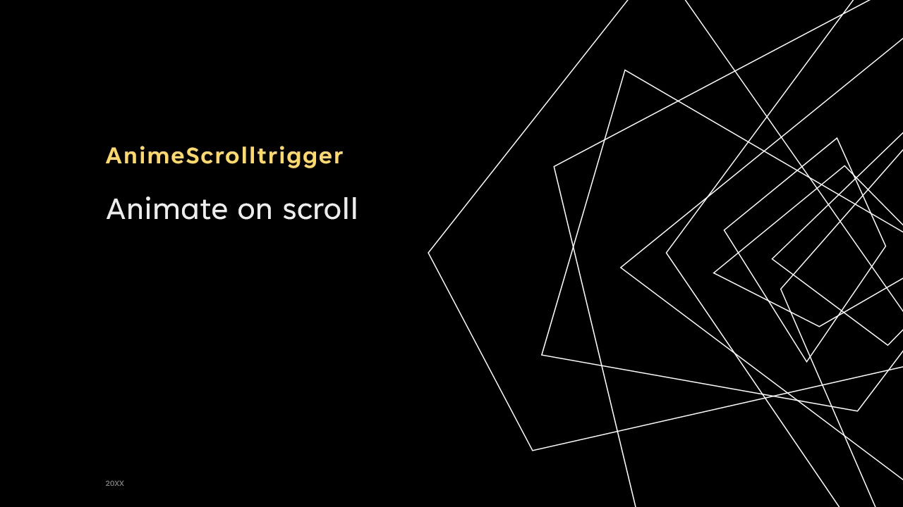

# Anime-ScrollTrigger



> Warning: Currently I am busy with my projects but I will try to release first beta version with complete documentation as soon as possible. 

## Introduction

`Anime-ScrollTrigger` is a library which is aimed to animate on scroll just like [`ScrollTrigger`](https://gsap.com/docs/v3/Plugins/ScrollTrigger/). Some name conventions would be different but the logic is pretty similar. 

I strongly recommend you to use that library because it is awesome and maintained. 

I don’t know how exactly that library is implemented in the context of coding. I only have abstract ideas of that library and tried to create my own one based on those ideas.

> 💡 The animation system of this library is solely dependent on [`animejs`](https://animejs.com/) library.

Most of usages are similar to [`ScrollTrigger`](https://gsap.com/docs/v3/Plugins/ScrollTrigger/) . Please have a look at the following instructions.

## Understanding How Trigger Works

It's important to know that there are two types of trigger offsets ( trigger positions ): 
- trigger element: start offset `startTriggerOffset` and end offset `endTriggerOffset`:
   
   Offsets are calculated on [height](https://developer.mozilla.org/en-US/docs/Web/CSS/height) of the trigger element relative to the [top](https://developer.mozilla.org/en-US/docs/Web/API/Window/top) of the trigger element. You can change the value with **first** word of `start` or `end` attribute under `scrollTrigger` attribute.
- scroller/container element: start offset `startScrollerOffset` and end offset `endScrollerOffset`. 
  
  Offsets are calculated relative to [clientHeight](https://developer.mozilla.org/en-US/docs/Web/API/Element/clientHeight) of the scroller element. You can change the value with **second** word of `start` or [`end`](#) attribute under `scrollTrigger` attribute.

Trigger will start when `startTriggerOffset` meets `startScrollerOffset`. 
Trigger will end when `endTriggerOffset` meets `endScrollerOffset`.
  For example,
   ```js
   ...
   scrollTrigger: {
     start: 'top bottom',
     end: '10% bottom',        
   }
   ```
  The above values indicate that 
  - animation will start when `the top` of trigger element and the `bottom end` of scroller meets.
  - animation will end when `10% of the trigger element height + top` of trigger element and `bottom end` of scroller meets.
## Installation

```bash
npm install anime-scrolltrigger
```

## Usages

### Import `AnimeScrolltrigger` 
```js
import AnimeScrollTrigger from 'anime-scrolltrigger' 
// or 
import AnimeScrollTrigger from 'anime-scrolltrigger/dist/scrollanime.es';
```

### Create an instance. 
  - container: Scroller HTML element
  - animations: Array of [animation object](#animation)

```js
let container = document.getElementById('container');
let boxes = document.querySelectorAll('.box')
let animations = [
        {
            targets: boxes[0],
            translateX: 100,
            easing: 'linear',
            scrollTrigger: {
                trigger: boxes[0],
                start: 'top 3%',
                end: 'bottom 30%',
            }
        },{
            targets: boxes[1],
            backgroundColor: '#a993ff',
            easing: 'linear',
            scrollTrigger: {
                trigger: boxes[1],
                start: 'top 40%',
                end: 'bottom center',
                lerp: true,
            }
    }];

new AnimeScrollTrigger(container,animations);
```
### Animation
Animation object has the following structure.
- targets: HTML elements to animate
- attributes which you want to animate ( same as animejs) - for example 
  ```js
  {
    translateX: 100,
    backgroundColor: 100,
    ...
  }
  ```
- scrollTrigger: [scroll trigger object](#scroll-trigger)
---
Example Animation Object
```js
{
    targets: boxes[1],
    backgroundColor: '#a993ff',
    easing: 'linear',
    scrollTrigger: {
        ...
    }
}
```

### Scroll Trigger

- #### trigger: `HTMLElement`
  
- #### start: `String`

  Indicate where `startTriggerOffset` will intersect with `startScrollerOffset` and when it intersects, animation will **start**. 
  Format is `"start-trigger-offset start-scroller-offset"`.
  Default value is `"top center"`.
  > Offset can be provided as percentage (e.g. 10%, 20%, -5%) or constant values: top, right, bottom, left.

- #### end: `String`

  Indicate where `endTriggerOffset` will intersect with `endScrollerOffset` and when it intersects, animation will **end**.  
  Format is `"end-trigger-offset end-scroller-offset"`.
  Default value is `"bottom center"`. 
  > Offset can be provided as percentage (e.g. 10%, 20%, -5%) or constant values: top, right, bottom, left.

- #### actions: `String`

  Action behavior when a certain event is triggered. Format is `"on-enter-action on-leave-action on-enter-back-action on-leave-back-action"`. Default value is "play none none reverse".
  > Note: when `lerp` is enabled, user-defined `on-enter-action` and `on-enter-back-action` will be ignored which means that animation will be forwarded on scrolling down and backwarded on scrolling up.

- #### debug: `Boolean` or `Object`

  Indicate to show start offset markers and end offset markers in order to see where they are located visually. 
  You can pass object in order to `change markers color`.
  ```js
  debug: { 
     startTriggerOffsetMarker: '#f6a945',
     endTriggerOffsetMarker: '#ffd291',
     startScrollerOffsetMarker: '#4b45f6',
     endScrollerOffsetMarker: '#d5d4ff',
  }
  ```

- #### events: `Object`

  Events triggered on scroll.
  - onEnter: 
  - onLeave: 
  - onEnterBack:
  - onLeaveBack:
  - onUpdate:
---
Example scroll trigger object is
```js
{
    trigger: boxes[1],
    start: 'top 40%',
    end: 'bottom center',
    lerp: true,
    debug: true,
    actions: 'play none none reverse',      
    events: { // Scroll Trigger Events
        onEnter: (trigger,progress)=>{}, 
        onLeave: (trigger,progress)=>{},
        onEnterBack: (trigger,progress)=>{},
        onLeaveBack: (trigger,progress)=>{},
        onUpdate: (animeInstance)=>{},
    }
}
```

## Examples

- [simple-boxes](./examples/simple-boxes.html)

## TO-DO

- [x] configurable marker colors 
- [ ] pin option